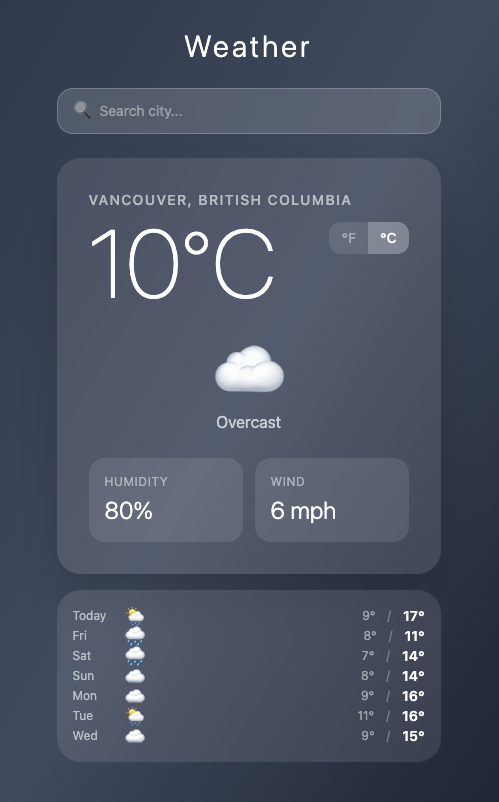

# Weather App

<p align="center">
  
</p>

A clean, responsive weather app that shows current conditions and a 7-day forecast for any city in the world — or your current location automatically.

## Features

- **Auto-location** — detects your coordinates on load and fetches local weather instantly
- **City search** — debounced autocomplete surfaces matching cities as you type
- **Current conditions** — temperature, weather description, humidity, and wind speed
- **7-day forecast** — daily high/low with weather icons for the week ahead
- **°F / °C toggle** — switch units without re-fetching data
- **Dynamic backgrounds** — gradient and animation change per weather condition (sun, rain, snow, fog, thunderstorm, and more)

## Stack

| Layer | Technology |
|---|---|
| UI framework | React 19 |
| Language | TypeScript |
| Build tool | Vite |
| Styling | Tailwind CSS v4 |
| Weather data | [Open-Meteo](https://open-meteo.com/) |
| City search | [Open-Meteo Geocoding](https://open-meteo.com/en/docs/geocoding-api) |
| Reverse geocoding | [Nominatim (OpenStreetMap)](https://nominatim.openstreetmap.org/) |

No API keys required — all data sources are free and open.

## Getting started

```bash
npm install
npm run dev
```

Then open [http://localhost:5173](http://localhost:5173).
