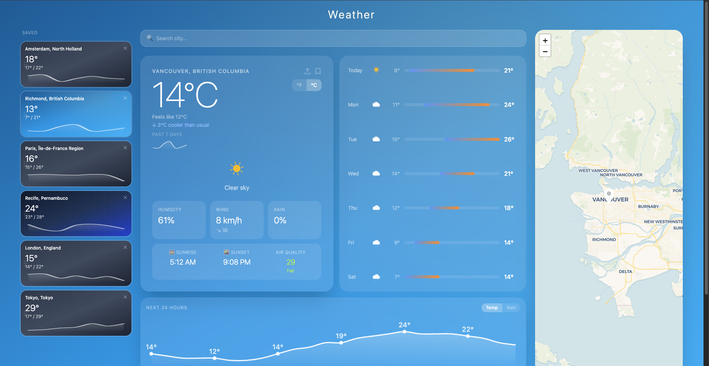
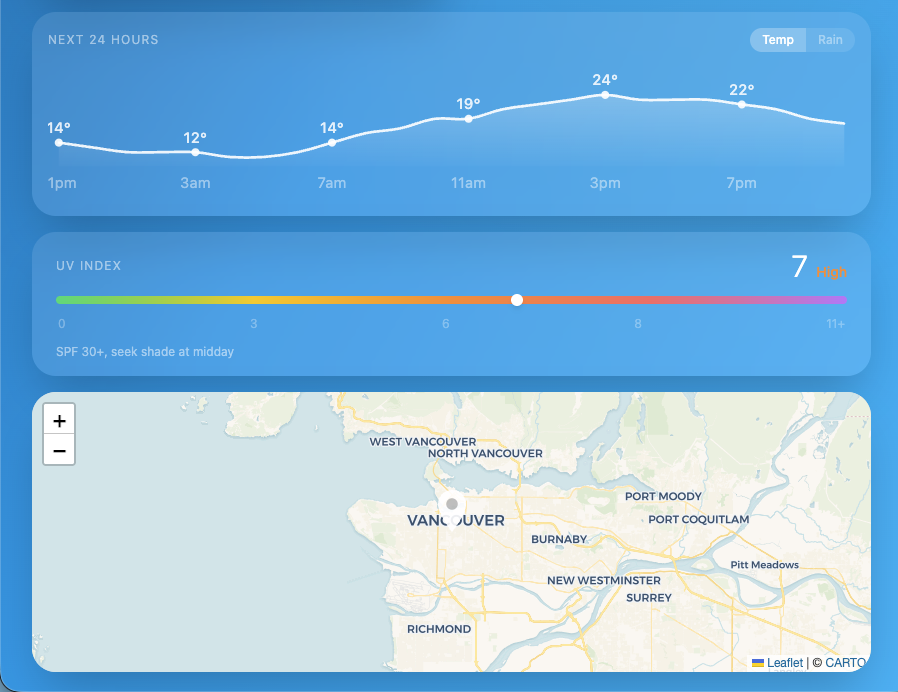
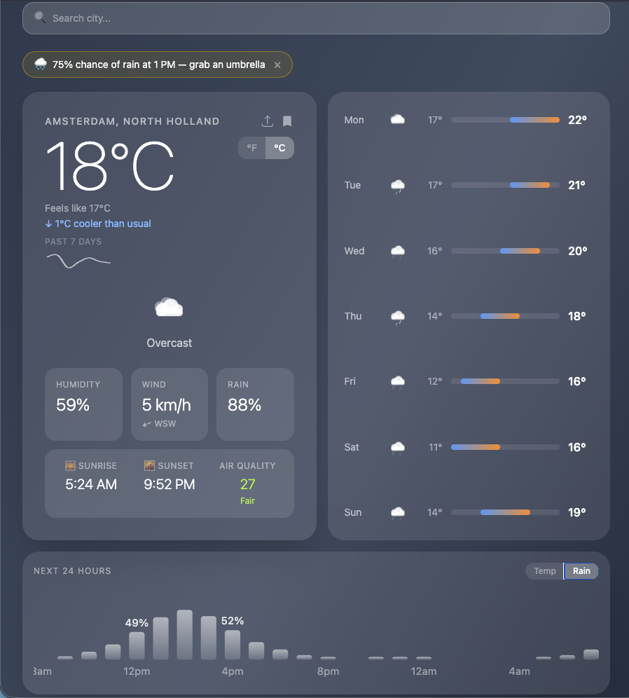
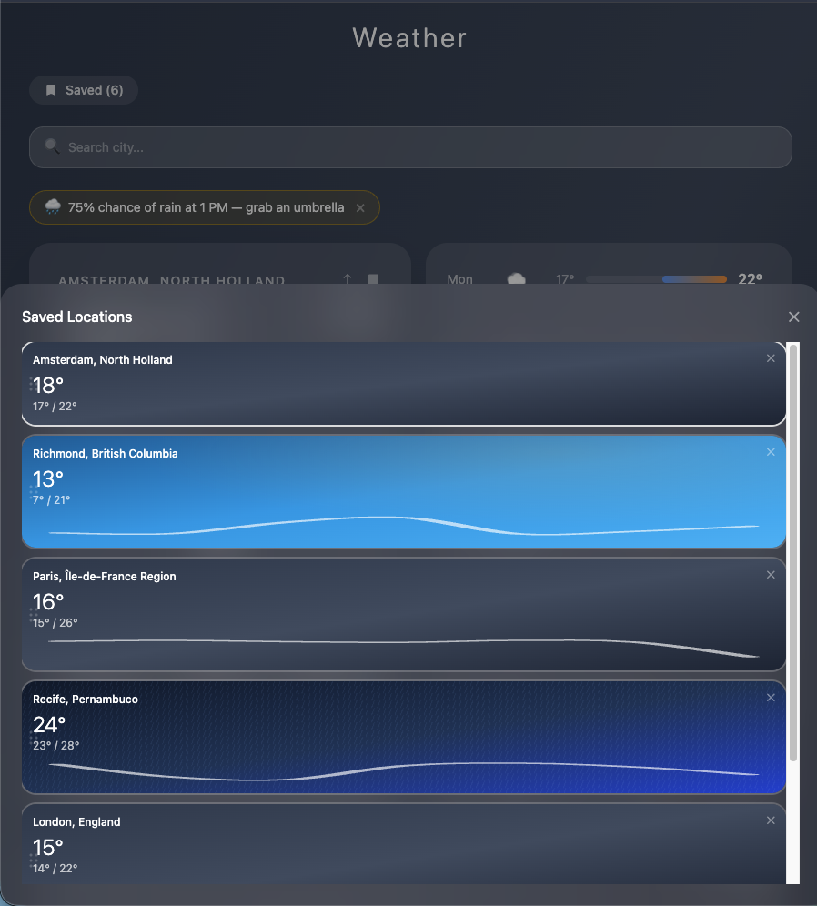

# Weather App

<table align="center">
  <tr>
    <td align="center">
      <br/>
      <sub>Desktop — 3-column layout</sub>
    </td>
    <td align="center">
      <br/>
      <sub>Hourly chart & UV index card</sub>
    </td>
  </tr>
  <tr>
    <td align="center">
      <br/>
      <sub>Rain alert & precipitation chart</sub>
    </td>
    <td align="center">
      <br/>
      <sub>Saved locations with sparklines</sub>
    </td>
  </tr>
</table>

A clean, responsive weather app that shows current conditions and a 7-day forecast for any city in the world — or your current location automatically.

## Features

- **Auto-location** — detects your coordinates on load and fetches local weather instantly
- **City search** — debounced autocomplete surfaces matching cities as you type
- **Current conditions** — temperature, feels-like, humidity, wind speed with compass direction, rain probability, and sunrise/sunset times
- **Historical comparison** — shows how today's temperature compares to the same date last year, with a 7-day sparkline of recent highs
- **Air quality index** — color-coded AQI label (Good → Extremely Poor) alongside current conditions
- **24-hour chart** — smooth hourly temperature curve or precipitation probability; toggle between Temp and Rain tabs
- **UV index card** — gradient scale (0–11+) with color-coded severity and sun protection recommendations
- **Weather alerts** — proactive banners for high rain probability, extreme temperatures, strong winds, and low humidity
- **7-day forecast** — daily high/low with weather icons for the week ahead
- **Interactive map** — Leaflet map pinned to the selected city; desktop right sidebar, mobile inline
- **°F / °C toggle** — switch units without re-fetching data
- **Dynamic backgrounds** — gradient and animation change per weather condition (sun, rain, snow, fog, thunderstorm, and more)
- **Saved locations** — bookmark cities and see their live weather and sparkline at a glance; drag-and-drop to reorder; desktop sidebar or mobile drawer
- **Share** — copy a shareable URL that restores the exact city and unit on open

## Stack

| Layer | Technology |
|---|---|
| UI framework | React 19 |
| Language | TypeScript |
| Build tool | Vite |
| Styling | Tailwind CSS v4 |
| Weather data | [Open-Meteo](https://open-meteo.com/) |
| City search | [Open-Meteo Geocoding](https://open-meteo.com/en/docs/geocoding-api) |
| Reverse geocoding | [Nominatim (OpenStreetMap)](https://nominatim.openstreetmap.org/) |
| Map | [Leaflet](https://leafletjs.com/) |

No API keys required — all data sources are free and open.

## Getting started

```bash
npm install
npm run dev
```

Then open [http://localhost:5173](http://localhost:5173).
